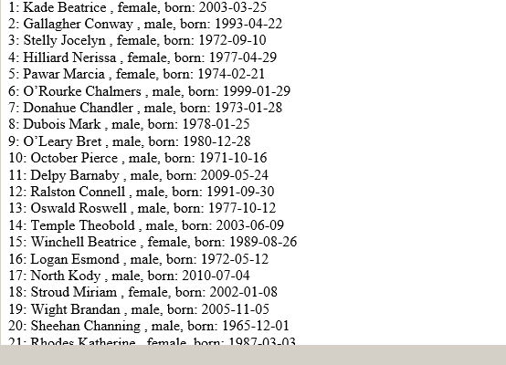

# Extensible Random People Generator

Class for generating random people data, for populating test databases and similar purposes
(for example create company fake employees list, or obfuscating personnel data before sending outside company)



## Description

Simple module for generating randomized "human" data: First name, Last name, middle name (if needed),
birthdate in desired age range.

Functions for generating any additional attributes can be easily added.
For example. you can add "department", "duty" or "salary" generators to make full emlpoyee data.

Included "language" modules for [english](src/class.randomdata.lang-en.php) and [russian](src/class.randomdata.lang-ru.php) people names.

## Using

```php
include_once('src/class.randomdata.php');
include_once('src/class.randomdata.lang-en.php'); // your language module can be here !

$sex_arr = array('m', 'f');

$gender = $sex_arr[rand(0,1)];

$ln = RandomData::getLastName($gender); // get random last name
$fn = RandomData::getFirstName($gender); // get random first name
$pn = RandomData::getMiddleName($gender); // and patronimnic/middle name
$birth = RandomData::getDate(4,50, 'Y-m-d'); // random birth date for 4 - 50 years old, 'YYYY-MM-DD'
echo "$ln, $fn $pn, ". ($gender==='f'?'female':'male') . ", born: $birth<br>";

```

You can add your language modules just by creating class.randomdata.lang-XX.php file (XX must be your language abbreviation)
and including it to your script. Example content of implementation for on "language":
```php
// file: myrandomdata.en.php
$options = array(
  'firstnames' => array(
    'm' => array( // male first names
    'Aaron', 'Abbott', 'Abel', 'Abner', 'Abraham', 'Adam', 'Addison', 'Adler', 'Adley', 'Adrian', 'Aedan'
    // ...
    )
    ,'f' => array( // female first names
    'Abigail', 'Ada', 'Adelaide', 'Adrienne', 'Agatha', 'Agnes', 'Aileen', 'Aimee', 'Alanna', 'Alarice', 'Alda'  )
    // ...
    )
  )
  ,'lastnames' => array('Abbott','Beckham','Black','Braxton','Brennan' /*...*/ )
  ,lastname_modifier' => NULL
);

RandomData::registerLanguage('xx', $options); // Now "active" language for randomdata is "xx"
```

Or you can add some 'basic' names to earlier pre-defined lists. For examle, to add some new last-names to the 'english' list:

```php
$my_firstnames = array('John', 'Mike'); // Base names to add
RandomData::addSource('firstnames', 'm', $my_firstnames); // add to male First names

$my_lastnames = array('Johnson', 'Harvester');
RandomData::addSource('lastnames', null, $my_lastnames); // Last names
```

* "firstnames" sub-array should contain all possible first names for current language, sub-array 'm' - for male names, 'f' - fo femail's.
* "lastnames" should contain "last names" that will be used in "randomized people" creation process.
* If patronimic (or middle) names used in your country, populate 'patrnames' sub-array (it must contain two subarrays too, 'm' amd 'f').

If last name for males and females has differense, you can pass "modifier" function name, that will correctly modify base last name by adding respective postfix,
"lastname_modifier" element must pass "modifier" user function name that will receives two parameters - "base" last name and gender ('m' or 'f') and returns
correct lastname for passed gender.
For example, russian last names based on common "base" usually have different: endings:

* Male: Sidorov
* Female: Sidorova
* Common (male,female): Sidorenko, Sidorovich

* Male: Belov, Beliy
* Female: Belova, Belaya
* Common: Bel'chenko

So a simplest modifier function (for russian last names) should at least add "a" at the end of a last name for female (in most cases, with exclusions).

## Setting limits for birthdate

By default random birth date range is between 1 and 60 years ago from current date. (see a var $config in the main class module).
To change these borders you can call function *RandomData::getRandomDate()* explicitly passing your min and max year values.
But when "integrate" function getPerson() for employee list (for instance), you will want to make "mature" people. So you can pass
your limits in $options parameter :
```php
$options = array('birthdate'=>array(20,60));
RandomData::getPerson($options);
// ...
```

Or you can call *setConfig()* method before any getPerson() using :

```php
RandomData::setConfig(array(
  'birthdate'=>array(
      'min'=>20
    , 'max'=>60
  )
));
```
## Adding user attributes

It is possible to add new atributes to be randomly generated for the object (person).
For example, you may need "department id", "salary" or a start working date for the full employee description.

```php
// Prepare function that returns random date value as a "start working date"
function randStartWork($par=0) {
    $ret = RandomData::getRandomDate(1,15); // random from 1 to 15 years from current date
    return $ret;
}
RandomData::registerAttribute('startwork', 'randStartWork');

// or in "closure" manner (PHP 5.3+):
RandomData::registerAttribute('startwork',
   function() {
     return RandomData::getRandomDate(1,15);
   }
);
```

## Getting randomized person data

First, You can call single function for each person attribute:

```php
$sex_arr = array('m', 'f');
$sex = $sex_arr[rand(0,1)];
$lastname  = RandomData::getLastName($sex);
$firstname = RandomData::getFirstName($sex);
$midname   = RandomData::getMiddleName($sex);
$birthdate = RandomData::getRandomDate(20,50, 'Y-m-d');
```

Second, you call static method getPerson() that wll return associative array holding randomized values for all attributes -
"built-in" and added by you :

```php
$person = RandomData::getPerson();
$db->append('employees', $person); // here must be your operator for adding data to DB
```

Working examples can be found in [examples](examples/) folder.

## License
Distributed under BSD (v3) License :
http://opensource.org/licenses/BSD-3-Clause

